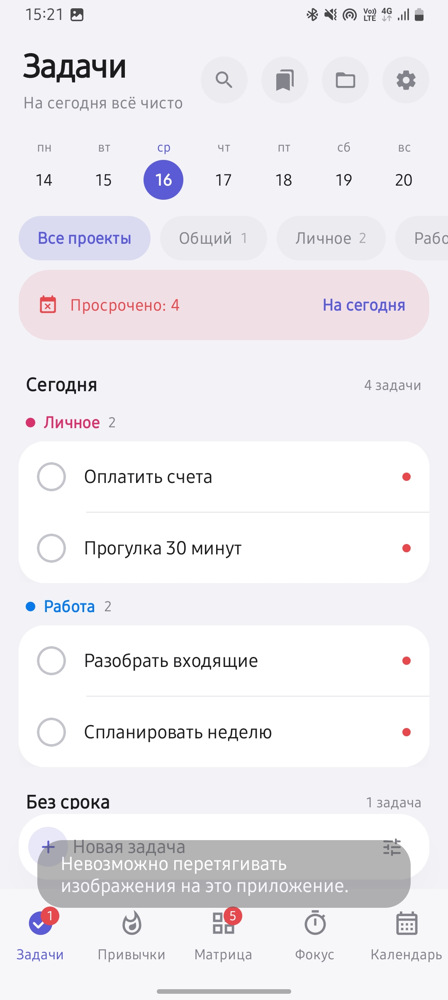
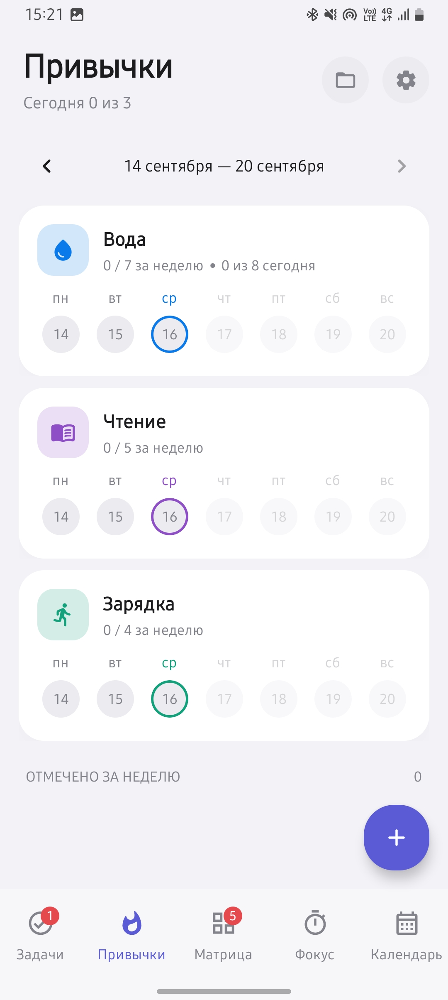
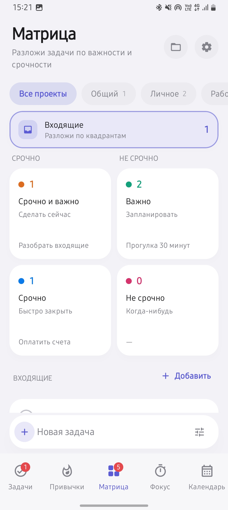
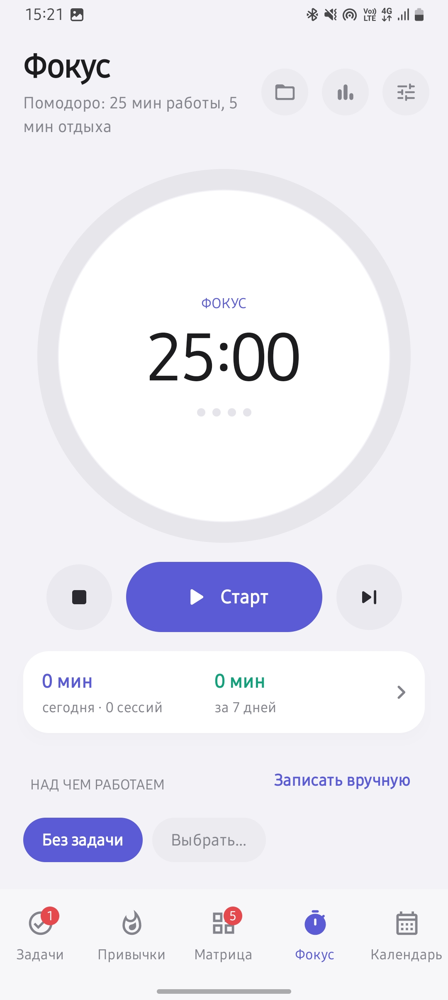
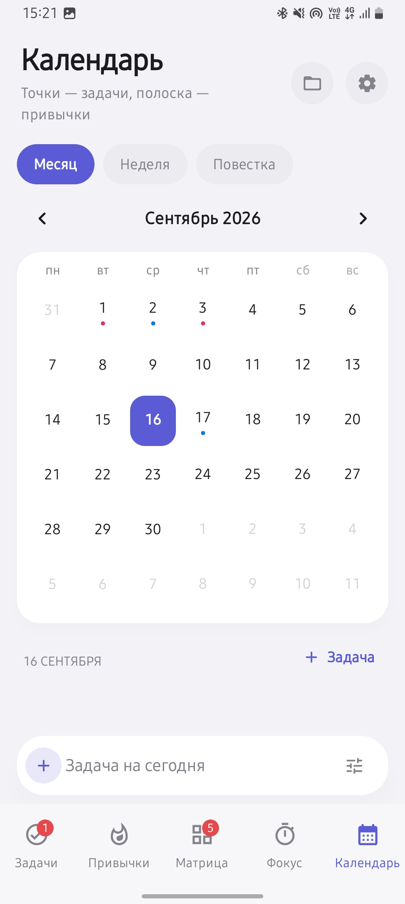
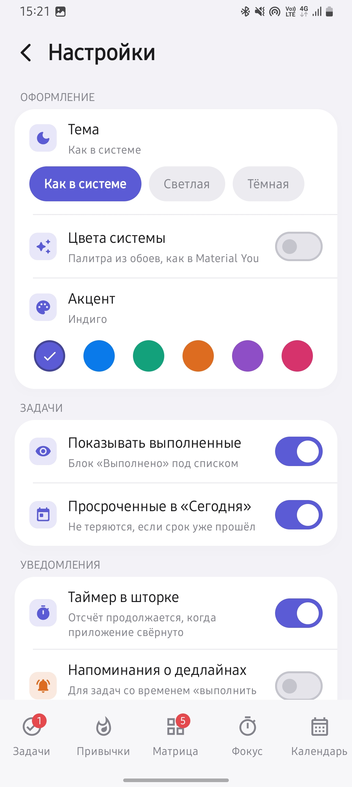
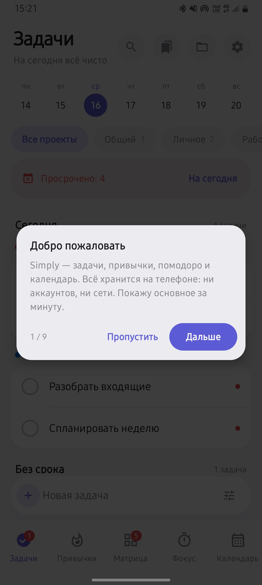

# Simply

[](https://kotlinlang.org)
[](https://developer.android.com/jetpack/compose)
[](https://m3.material.io)
[](https://developer.android.com)
[](https://developer.android.com/build)
[](https://gradle.org)
[](https://github.com/Kotlin/kotlinx.serialization)
[](#)
[](LICENSE)

Простой личный трекер для Android: задачи, проекты, привычки, матрица Эйзенхауэра,
помодоро и календарь. Всё хранится локально, без аккаунтов и сети.

## Скриншоты

| Задачи | Привычки | Матрица |
|---|---|---|
|  |  |  |

| Фокус | Календарь | Настройки |
|---|---|---|
|  |  |  |

| Вводный гид |
|---|
|  |

## Экраны

| Вкладка | Что делает |
|---|---|
| **Задачи** | Строка быстрого ввода внизу: набрал название — задача уже в списке, срок и проект можно проставить позже. Список разбит по дням: самые ранние сроки сверху, дальше «Завтра», конкретные даты и «Без срока». Внутри дня задачи разложены по проектам — у каждого свой цветной заголовок и подкрашенный блок. Дедлайн «Выполнить до» с датой и временем, фильтры «Все / Сегодня / Просрочено», заметки, блок «Выполнено» |
| **Привычки** | Недельная сетка с отметками, серии подряд идущих дней, цель «N раз в неделю», значок из набора векторных иконок |
| **Матрица** | Квадранты «важно × срочно» с фильтром по проектам; список выбранного квадранта тоже разделён по проектам |
| **Фокус** | Помодоро с кольцевым таймером и циклами. Цель сессии выбирается через поиск по задачам и привычкам, либо «Без задачи». Кнопка графика в заголовке открывает статистику |
| **Календарь** | Месяц с точками задач и полоской привычек, список дел на выбранный день |

**Шаблоны.** Заготовка задачи с названием, заметкой, проектом, квадрантом и временем «выполнить до».
Открываются закладкой в заголовке «Задач». Шаблон можно поставить в один тап на сегодня, завтра
или выбранную дату — либо включить повтор: каждый день, по будням, по выбранным дням недели,
каждые N дней или раз в месяц. Тогда задача появляется сама при первом запуске в подходящий день
(пропущенные дни не догоняются, чтобы список не заваливало копиями). Созданные задачи хранят
ссылку на шаблон, поэтому в шаблоне видно «поставлено N, выполнено M», а в задаче — из какого
она шаблона. Любую существующую задачу можно превратить в шаблон кнопкой в её редакторе.

**Статистика.** Каждый рабочий отрезок помодоро пишется в историю: минуты, дата, цель, проект
и был ли отрезок доведён до конца. Экран статистики показывает время сегодня / за 7 дней / всего,
столбики по последним 14 дням, топ задач и привычек по времени (с числом сессий и средней
длительностью), распределение по проектам и метрики — доля доведённых до конца сессий, средняя
и самая длинная сессия, дни с фокусом, текущая и лучшая серия, самый рабочий день недели
и рекорд за день. Отдельных счётчиков в данных нет, всё считается из истории сессий.

**Проекты.** У каждой задачи всегда есть проект. Если проект не выбран, задача попадает в
встроенный «Общий» — его нельзя удалить. При удалении своего проекта его задачи переезжают
в «Общий», а не пропадают.

**Быстрый ввод.** На «Задачах», в «Матрице» и в «Календаре» внизу закреплена строка добавления.
Она подставляет контекст сама: активный проект и фильтр на «Задачах», выбранный квадрант в
«Матрице», выбранный день в «Календаре». Кнопка справа от поля открывает полный редактор
с уже введённым названием, если детали нужны сразу. В интерфейсе не используются эмодзи —
только векторные иконки.

**Вводный гид.** При первом запуске приложение само проводит по основам: экран
темнеет, подсвечивается одно место (вкладка, строка ввода, кнопки заголовка),
рядом — пара фраз о разделе. Девять коротких шагов, шаг сам открывает нужную
вкладку. Пройти заново — «Настройки → Как пользоваться».

Настройки открываются шестерёнкой в заголовке любого экрана: тема (системная / светлая / тёмная),
акцентный цвет (6 вариантов; тёмная тема — сине-графитовая палитра, а не чёрная), поведение списка задач, длительности помодоро, очистка и сброс данных.

## Технически

- Kotlin + Jetpack Compose, Material 3, единственная Activity
- `minSdk 26`, `compileSdk/targetSdk 36`, AGP 8.13, Kotlin 2.2.20, Gradle 8.14.3
- Состояние — один `AppData` в `StateFlow`, хранится в `filesDir/simply_data.json`
  (kotlinx.serialization, запись через временный файл, автосохранение с задержкой 300 мс
  плюс принудительное сохранение при уходе в фон)
- Иконка — адаптивный векторный drawable (градиент + галочка), есть monochrome-слой для тем Android 13+

## Сборка

```bash
./gradlew assembleDebug     # app/build/outputs/apk/debug/app-debug.apk
./gradlew assembleRelease   # app/build/outputs/apk/release/app-release.apk
./gradlew installDebug      # поставить на подключённое устройство
```

`local.properties` содержит путь к Android SDK. Release подписан debug-ключом —
для личной установки этого достаточно, для публикации в Play нужен свой keystore.

## Авторы

- eightsimvols@gmail.com — автор
- 007daymos007@gmail.com — разработчик

## Лицензия

[MIT](LICENSE)
